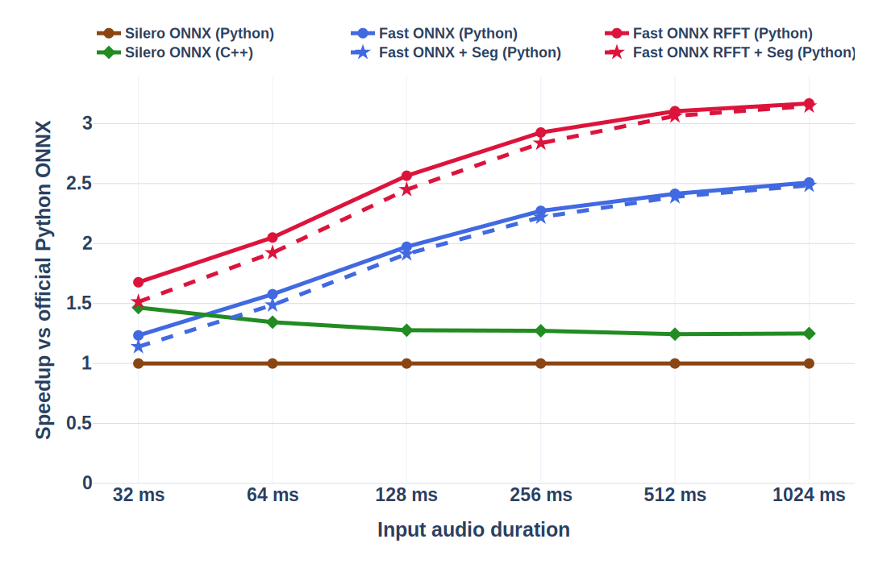
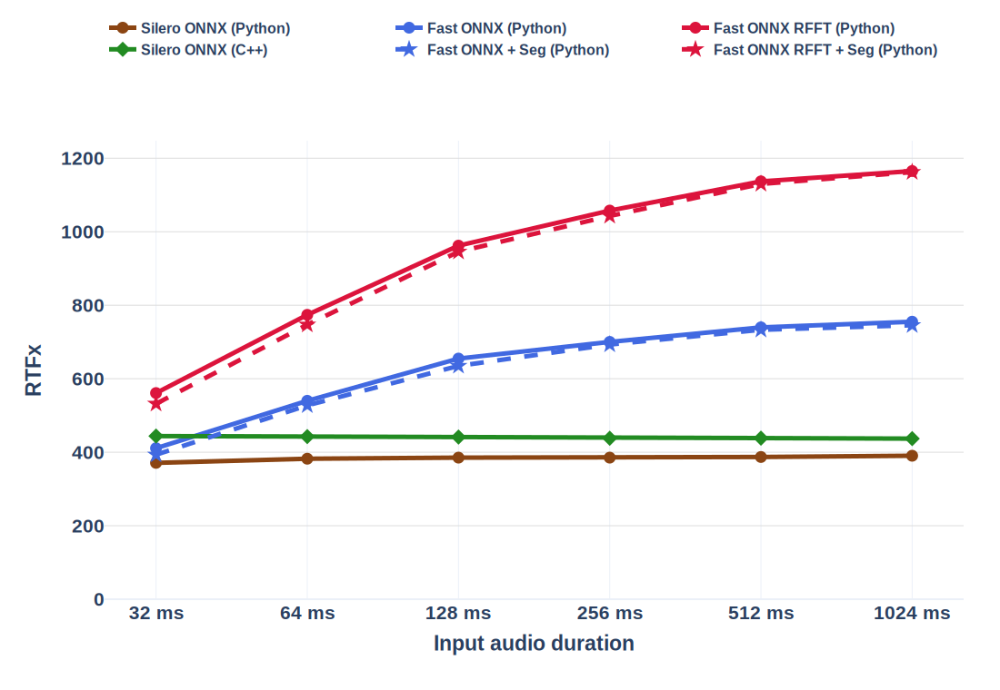
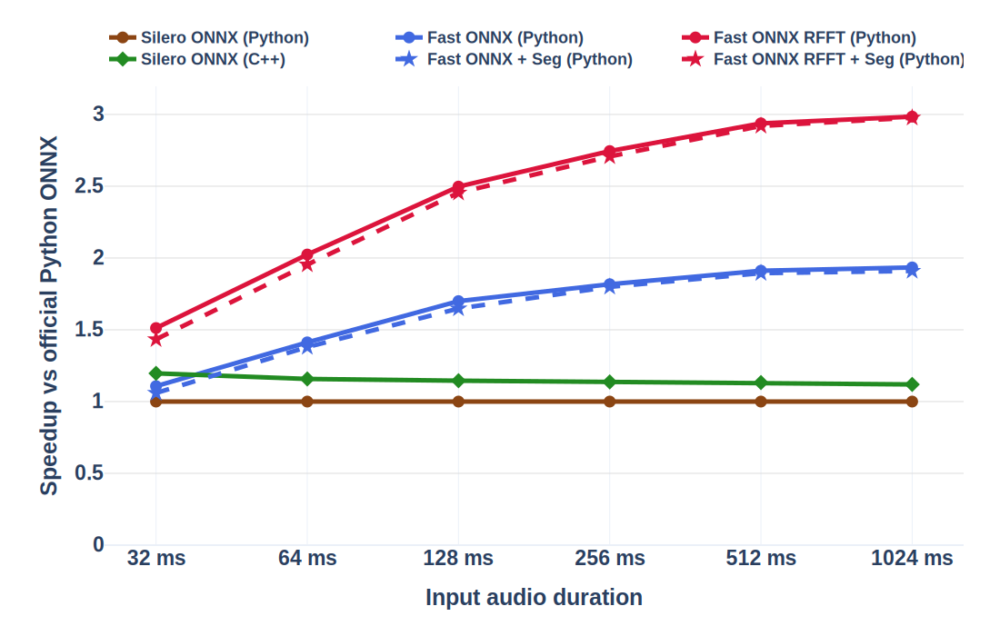

# Fast Silero VAD

<p>
  <a href="https://github.com/SoundsGoodAI/fast-silero-vad/actions/workflows/ci.yml"></a>
  
  
  
  <a href="https://docs.astral.sh/ruff/"></a>
  <a href="LICENSE"></a>
</p>

**Fast Silero VAD** combines a streamlined ONNX graph with an optimized spectral frontend to significantly improve CPU throughput while producing speech probabilities that are numerically equivalent to the original model.

<table>
  <tr>
    <th colspan="2">
      <div align="center"><big>AMD EPYC 9655 (single thread)</big></div>
    </th>
  </tr>
  <tr>
    <td width="50%"></td>
    <td width="50%"></td>
  </tr>
  <tr>
    <th colspan="2">
      <div align="center"><big>Apple M4 Max (single thread)</big></div>
    </th>
  </tr>
  <tr>
    <td width="50%"></td>
    <td width="50%"></td>
  </tr>
</table>

**Solid lines** measure probability inference.
**Dashed lines** include speech segmentation.
**RTFx** is a ratio of processed audio duration to processing time.

- The Fast RFFT engine rises from **561 RTFx** (**1.51x** speedup) at 32 ms
  to **1,165 RTFx** (**2.98x** speedup) at 1024 ms.
- Including the Numba-compiled Segmenter, the full Fast RFFT pipeline reaches
  **532 RTFx** (**1.43x** speedup) at 32 ms and **1,162 RTFx** (**2.98x**
  speedup) at 1024 ms.
- The standard Fast ONNX graph reaches **755 RTFx** (**1.93x** speedup) at
  1024 ms, while the full standard pipeline reaches **745 RTFx** (**1.91x**).
  Both exceed the upstream C++ implementation from 64 ms onward.

These measurements use deterministic synthetic 16 kHz mono audio on macOS
26.5.1 with Python 3.14.5, ONNX Runtime 1.27.0, a `0.005` segmentation
threshold, and one execution thread. Values are median latencies from 1,000
runs after 50 warmups; model loading and WAV decoding are excluded.

- The Fast RFFT Silero VAD engine rises from **657 RTFx** (**1.68x** speedup) at
  32 ms to **1,448 RTFx** (**3.17x** speedup) at 1024 ms.
- With the Numba-compiled Segmenter included, the full Fast RFFT pipeline reaches
  **593 RTFx** (**1.51x** speedup) at 32 ms and **1,438 RTFx** (**3.15x**
  speedup) at 1024 ms.
- Even without RFFT optimization, the standard Fast Silero VAD graph reaches
  **2.51x** speedup at 1024 ms; the full pipeline with Segmenter reaches
  **2.49x**. Both outperform the upstream C++ Silero ONNX implementation from
  64 ms onward.
- Official Python and C++ Silero VAD settle into approximately constant throughput as
  input duration grows.

Silero ONNX (Python) calls `load_silero_vad(onnx=True).audio_forward()` from the
installed official `silero-vad` package.
Silero ONNX (C++) uses the upstream Silero VAD
[`examples/c++`](https://github.com/snakers4/silero-vad/tree/b163605b3f44c3aadf28f97b125a2f7c461e9a7f/examples/c%2B%2B)
ONNX implementation. Its unchanged `silero.cc` is
compiled with C++20, `-O3`, and `-DNDEBUG` and linked against ONNX Runtime.
Values are median latencies from 500 runs after 50 warmups.
Model loading and WAV decoding are excluded.

## Quick Start

Install [`uv`](https://docs.astral.sh/uv/getting-started/installation/) on Linux
or macOS with the official standalone installer:

```bash
curl -LsSf https://astral.sh/uv/install.sh | sh
```

On macOS, Homebrew can be used instead:

```bash
brew install uv
```

Install the project and its export dependencies:

```bash
uv sync --extra export
```

Export a 16 kHz offline bundle with the optimized real FFT frontend. The
exporter uses the JIT checkpoint bundled with the official `silero-vad`
package:

```bash
uv run --frozen --extra export fast-silero-vad-export \
  --output-dir-path models/fast_silero_vad_16k \
  --model-type offline_vad \
  --vad-branch 16k \
  --threshold 0.01 \
  --min-speech-duration-ms 100 \
  --max-speech-duration-ms 30000 \
  --min-silence-duration-ms 1000 \
  --speech-pad-ms 300 \
  --use-onnxruntime-custom-op
```

The exporter stores the segmenter policy in `model_config.yaml`; both offline
and streaming runtimes use these values:

| parameter | value | behavior |
|---|---:|---|
| `threshold` | `0.01` | Opens or continues speech when the model probability is at least this value. |
| `min_speech_duration_ms` | `100` | Discards detected speech shorter than 100 ms. |
| `max_speech_duration_ms` | `30000` | Splits longer speech near a low-probability region while keeping both sides at least the minimum speech duration. |
| `min_silence_duration_ms` | `1000` | Closes an active segment after 1000 ms of below-threshold probabilities. |
| `speech_pad_ms` | `300` | Adds 300 ms context around natural VAD boundaries. Forced maximum-duration splits are always adjacent and unpadded. |

The example creates an `offline_vad` bundle. Fast Silero VAD supports both
runtime modes:

| model type | input behavior | state behavior |
|---|---|---|
| `offline_vad` | One complete audio array per call | Resets after every call |
| `streaming_vad` | Successive audio chunks | Preserved until `final=True` |

To create a streaming bundle, rerun the export command with a different output
directory and `--model-type streaming_vad`. The command-line detector reads the
model type from `model_config.yaml` and handles either mode automatically:

```bash
uv run --frozen fast-silero-vad \
  --model-dir models/fast_silero_vad_16k \
  --wav-dir /path/to/wav/files \
  --output-path segments.tsv
```

The Python API accepts one-dimensional normalized floating-point audio. An
offline model processes the complete recording in one call:

```python
import numpy as np

from fast_silero_vad import VAD

audio = np.zeros(16000, dtype=np.float32)

vad = VAD("models/fast_silero_vad_16k")
vad.apply_samplerate(16000)
segments = vad(audio)
```

A streaming model preserves inference and segmentation state between chunks:

```python
import numpy as np

from fast_silero_vad import VAD

audio = np.zeros(16000, dtype=np.float32)

vad = VAD("models/fast_silero_vad_16k_streaming")
vad.apply_samplerate(16000)

segments = []
chunk_samples = 1600
for start in range(0, len(audio), chunk_samples):
    end = min(len(audio), start + chunk_samples)
    segments.extend(vad(audio[start:end], final=end == len(audio)))
```

## Why Fast Silero VAD Scales

At 16 kHz, one Silero model window is 512 samples:

```text
512 samples / 16,000 samples per second = 0.032 seconds = 32 ms
```

The official low-level ONNX wrapper accepts exactly one 512-sample window per
call. Its long-audio paths pad the final window when necessary and iterate over
the input in 512-sample steps:

- [`OnnxWrapper.audio_forward`](https://github.com/snakers4/silero-vad/blob/b163605b3f44c3aadf28f97b125a2f7c461e9a7f/src/silero_vad/utils_vad.py#L98-L109)
- [`get_speech_timestamps`](https://github.com/snakers4/silero-vad/blob/b163605b3f44c3aadf28f97b125a2f7c461e9a7f/src/silero_vad/utils_vad.py#L312-L330)

Consequently, doubling the audio duration doubles the number of ONNX Runtime
calls. Processing time grows almost linearly with audio duration, leaving the
official Silero VAD RTFx approximately constant. The upstream official C++ ONNX
implementation follows the same pattern, but its lower language overhead gives
it a higher constant RTFx.

Fast Silero VAD accepts several model windows in one ONNX graph call and returns the
same sequence of 32 ms probabilities. This produces two independent gains:

1. **Single-call multi-window execution.** The standard graph amortizes Python,
   tensor binding, dispatch, and ONNX Runtime call overhead across all windows.
2. **Optimized real FFT frontend.** The custom-op graph replaces the original
   Conv1d Fourier basis with a C++ real FFT using precomputed Hann-window and
   twiddle values.

The standard graph does not improve the 32 ms case because one model window
leaves no repeated call overhead to amortize. The custom real FFT frontend still
provides a measurable improvement at that duration.

## Reproducing

The benchmark tools are repository-only. The commands below reproduce the
Apple M4 Max sweep from a project checkout. They require `uv`, network access
for the first export and C++ build, and a C++20 compiler named `c++`.

All ONNX Runtime sessions use one inter-op and one intra-op thread. On Linux,
prefix the timed Python and C++ commands with `taskset -c 0` to also pin them to
one logical CPU. macOS does not provide `taskset`, so run the commands as shown.
The checked-in Apple results use 1,000 timed runs after 50 warmups. The AMD EPYC
results used the same sweep with 500 timed runs and Linux CPU affinity.

### Setup

Install the export and plotting dependencies and create the output directory:

```bash
uv sync --frozen --extra export --extra plot
mkdir -p benchmarks/output/m4_max
```

Export one standard bundle and one custom-op RFFT bundle with matching model
and segmenter settings:

```bash
uv run --frozen --extra export fast-silero-vad-export \
  --output-dir-path models/benchmark_standard_16k \
  --model-type offline_vad \
  --vad-branch 16k \
  --threshold 0.005 \
  --min-speech-duration-ms 100 \
  --max-speech-duration-ms 30000 \
  --min-silence-duration-ms 1000 \
  --speech-pad-ms 0

uv run --frozen --extra export fast-silero-vad-export \
  --output-dir-path models/benchmark_custom_op_16k \
  --model-type offline_vad \
  --vad-branch 16k \
  --threshold 0.005 \
  --min-speech-duration-ms 100 \
  --max-speech-duration-ms 30000 \
  --min-silence-duration-ms 1000 \
  --speech-pad-ms 0 \
  --use-onnxruntime-custom-op
```

The Python benchmark creates its deterministic synthetic signal in memory.
The C++ harness requires a mono 16-bit PCM WAV, so create the equivalent
1.024-second, 16 kHz input:

```bash
uv run --frozen --extra export python - <<'PY'
import wave
from pathlib import Path

import numpy as np

from benchmarks.utils import make_synthetic_audio

output_path = Path("benchmarks/output/m4_max/synthetic_1024ms.wav")
audio = make_synthetic_audio(1.024, 16000)
pcm = np.clip(audio * (2**15 - 1), -32768, 32767).astype("<i2")

with wave.open(str(output_path), "wb") as output:
    output.setnchannels(1)
    output.setsampwidth(2)
    output.setframerate(16000)
    output.writeframes(pcm.tobytes())
PY
```

### Python

```bash
uv run --frozen --extra export python -m benchmarks.duration_sweep \
  --standard-model-dir models/benchmark_standard_16k \
  --custom-op-model-dir models/benchmark_custom_op_16k \
  --durations-ms 32 64 128 256 512 1024 \
  --samplerate 16000 \
  --threshold 0.005 \
  --min-speech-duration-ms 100 \
  --max-speech-duration-ms 30000 \
  --min-silence-duration-ms 1000 \
  --speech-pad-ms 0 \
  --warmup 50 \
  --repeats 1000 \
  --output-tsv-path benchmarks/output/m4_max/python.tsv
```

### C++

The build script downloads the pinned upstream `examples/c++` implementation,
compiles its ONNX path with C++20, and links it against the exact ONNX Runtime
shared library installed in the project environment. Matching C/C++ headers
are downloaded from the corresponding ONNX Runtime tag when absent from the
local cache.

```bash
uv run --frozen --extra export python benchmarks/cpp/build.py

OFFICIAL_ONNX="$(
  uv run --frozen --extra export python -c \
    'from pathlib import Path; import silero_vad; print(Path(silero_vad.__file__).resolve().parent / "data" / "silero_vad.onnx")'
)"

benchmarks/cpp/build/vad_benchmark \
  "$OFFICIAL_ONNX" \
  benchmarks/output/m4_max/cpp.tsv \
  50 1000 \
  benchmarks/output/m4_max/synthetic_1024ms.wav \
  0 \
  32 64 128 256 512 1024
```

### Plots

```bash
uv run --frozen --extra plot python -m benchmarks.plot_benchmark \
  --input-tsv-path \
    benchmarks/output/m4_max/python.tsv \
    benchmarks/output/m4_max/cpp.tsv \
  --output-dir-path docs/plots/m4_max \
  --formats svg
```
